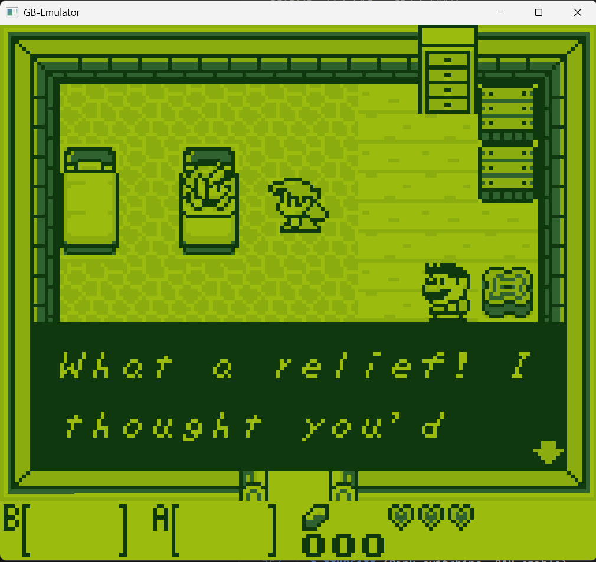
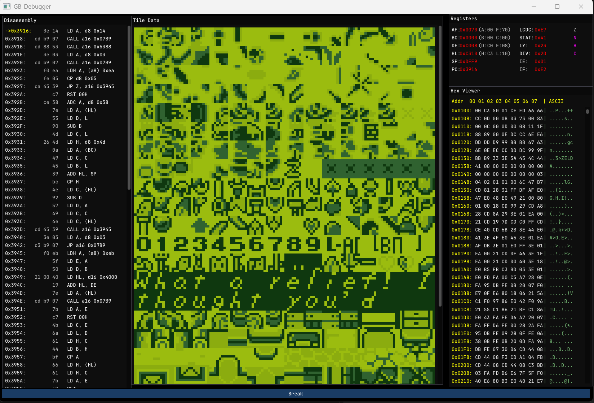

# Simple-Boy


A cycle accurate, high performance Game Boy (DMG-01) emulator written in C++17. Built with modern software design patterns, a comprehensive interactive debugger, and fully optimized audio/graphics rendering using SFML and ImGui. Simple-Boy focuses on clean cycle accurate timing, precise hardware behavior (such as custom LCD timings and stack interrupt execution bounds), and automated test harness execution.

---

## Screenshots

| Game Boy Emulation | Interactive ImGui Debugger |
| :---: | :---: |
|  |  |
| *Running Game Boy ROMs in full speed (60 FPS).* | *Disassembly, registers, tiles, and memory hex viewer.* |

---

## Key Features

* **CPU**: Complete emulation of the Sharp LR35902 CPU, featuring cycle-accurate instruction timings, correct interrupt boundaries, and stack-frame stack pointer validation.
* **PPU (Graphics)**: Pixel pipeline with correct timing for LCD status modes, scanline synchronization, sprites (OBJ rendering), background rendering, and window maps.
* **APU (Audio)**: Multi-channel audio engine emulating CH1 & CH2 (Square wave with sweep), CH3 (Custom Wave Pattern with retrigger safety), and CH4 (White Noise). Audio streams smoothly via an asynchronous ring-buffered SFML `SoundStream`.
* **Memory Mapper (MBC)**: Support for a wide variety of cartridges:
  * **ROM Only**
  * **MBC1** (Bank switching, RAM enable)
  * **MBC2** (Built in 512-nibble RAM)
  * **MBC3** (RTC clock registers, RAM banking)
  * **MBC5** (Up to 8MB ROM, RAM banking)
  * **Battery-backed Save Support**: Automatically saves and loads game battery RAM (saves as `<rom_name>.sav` or `<rom_name>.battery` in the ROM folder).
* **Automated Serial Outputs**: Fully hooks the Game Boy link port (`$FF01` and `$FF02`) to output test ROM text directly to your shell.

---

## Interactive Debugger

Simple-Boy features a premium desktop debugger built on ImGui, launching side by side with your game window when requested.

### Debugger Panels:
1. **Disassembly Viewer**: Shows surrounding assembly instructions and highlights the program counter (`PC`) pointer.
2. **Registers Panel**: Displays the 16-bit registers (`AF`, `BC`, `DE`, `HL`) with dual 8-bit split values (e.g. `AF (A:XX F:XX)`), stack pointer (`SP`), program counter (`PC`), current CPU ticks, and CPU status flags (`Z`, `N`, `H`, `C`).
3. **Tile Viewer**: Displays visual VRAM data (CHR tiles) in real-time, helping you debug sprite and background assets.
4. **Hex Memory Viewer**: A fully scrollable 64KB memory viewer displaying hex bytes alongside their ASCII representation.

### Console CLI Commands:
You can control the emulator thread directly using the console input box at the bottom of the debugger window:
* `c` : Continue emulation.
* `s` : Step Into (runs the next CPU instruction).
* `n` : Step Over (executes function calls and steps to the next line).
* `f` : Step Out (runs until the current stack frame returns).
* `b <hex_address>` : Toggle a breakpoint at the given address (e.g., `b 0100`).
* `r` : Reload the ROM and reset the emulator safely without dropping the audio stream.
* `h <hex_address>` : Jump the Hex Viewer memory panel to the specified address (e.g., `h C000`).

---

## Environment Variables & CLI Flags

Simple-Boy is designed to launch cleanly into gameplay by default, but it requires the path to a ROM file to run. This can be configured via the command line or environment variables.

### CLI Flags
* `[path/to/rom]` : The path to the Game Boy ROM file (e.g. `roms/Tetris.gb`). This argument is required.
* `--debug` : Launches the emulator along with the ImGui-SFML debugger window. (Emulation begins in a paused state).
* `--headless` : Runs the emulator without opening any SFML rendering windows. Ideal for automated testing and CI pipelines.

### Environment Variables
* `GB_DEBUG=1` : Equivalent to running the emulator with the `--debug` flag.

---

## Cloning & Building

Clone the repository:

### 1. Clone the Repository
```bash
git clone https://github.com/Pratyush-gg/Simple-Boy.git
cd Simple-Boy
```

---

### 2. Install Dependencies

#### Windows:
We recommend installing compilers and build tools via **MSYS2 (UCRT64)** or **winget**.
* **Via MSYS2 UCRT64** (Open MSYS2 UCRT64 terminal and run):
  ```bash
  pacman -S mingw-w64-ucrt-x86_64-gcc mingw-w64-ucrt-x86_64-cmake mingw-w64-ucrt-x86_64-ninja mingw-w64-ucrt-x86_64-sfml git
  ```
* **Via winget**:
  ```powershell
  winget install Kitware.CMake Git.Git Ninja-build
  ```

#### Linux (Ubuntu/Debian) & WSL:
Run the following in your terminal to install the compiler, build tools, Git, and the development libraries required to compile SFML from source:
```bash
sudo apt-get update
sudo apt-get install build-essential cmake git ninja-build \
    libx11-dev libxrandr-dev libxcursor-dev libxi-dev \
    libgl1-mesa-dev libudev-dev libasound2-dev libopenal-dev \
    libfreetype-dev libvorbis-dev libflac-dev libogg-dev \
    libharfbuzz-dev -y
```

---

### 3. Building the Emulator

We recommend using the **Ninja** generator for fast compilation.

#### Option A: Ninja (Recommended for speed)
```bash
# Configure the project
cmake -G Ninja -DCMAKE_BUILD_TYPE=Release -B cmake-build-release -S .

# Build the project
cmake --build cmake-build-release
```

#### Option B: MinGW Makefiles (Windows CLI)
```powershell
# Configure the project
cmake -G "MinGW Makefiles" -DCMAKE_BUILD_TYPE=Release -B cmake-build-release -S .

# Build the project (using all parallel CPU cores)
cmake --build cmake-build-release -j
```

#### Option C: Unix Makefiles (Linux standard)
```bash
# Configure the project
cmake -G "Unix Makefiles" -DCMAKE_BUILD_TYPE=Release -B cmake-build-release -S .

# Build the project (using all parallel CPU cores)
cmake --build cmake-build-release -j$(nproc)
```

#### Option D: Visual Studio (MSVC on Windows)
```powershell
# Configure the project
cmake -B cmake-build-release -S .

# Build in Release mode
cmake --build cmake-build-release --config Release -j
```

---

## Running the Emulator

### Method A: Running the Precompiled Windows Release (.zip)
If you downloaded the precompiled Windows zip package from the GitHub Releases page:
1. Extract the ZIP archive completely to a folder on your computer.
2. Place your Game Boy ROM file (`.gb`) in that folder or note its path.
3. Open PowerShell or Command Prompt in the extracted directory and run:
   ```powershell
   # Standard gameplay mode
   .\Simple-Boy.exe roms/Tetris.gb

   # Launch with the interactive debugger
   .\Simple-Boy.exe roms/Tetris.gb --debug
   ```

*Note: The Windows executable is 100% statically linked (including standard libraries, SFML, and ImGui) and runs as a standalone binary without requiring any DLL files.*

### Method B: Running the Precompiled Linux Release (.tar.gz)
If you downloaded the precompiled Linux tarball from the GitHub Releases page:
1. Install system library dependencies:
   ```bash
   sudo apt-get update
   sudo apt-get install libopenal1 libgl1 libudev1 libx11-6 libxrandr2 libxcursor1 libxi6 -y
   ```
2. Extract the Tarball archive:
   ```bash
   tar -xzf Simple-Boy-v1.0.0-Linux.tar.gz
   ```
3. Run the emulator inside the extracted folder:
   ```bash
   # Standard gameplay mode
   ./Simple-Boy roms/Tetris.gb

   # Launch with the interactive debugger
   ./Simple-Boy roms/Tetris.gb --debug
   ```

*Note: The Linux executable statically links C/C++ runtimes and SFML/ImGui libraries to ensure maximum portability, dynamically loading only the graphics/display server drivers (OpenGL, X11, udev) at runtime.*

### Method C: Running after building from source
If you compiled the project yourself from source, you can run it from the repository root:

```bash
# Standard Gameplay mode
./cmake-build-release/bin/Simple-Boy.exe roms/Tetris.gb

# Running with the interactive debugger
./cmake-build-release/bin/Simple-Boy.exe roms/Tetris.gb --debug

# Running in headless mode for quick automated testing
./cmake-build-release/bin/Simple-Boy.exe roms/02-interrupts.gb --headless
```

### Keyboard Controls
When in gameplay mode, the Game Boy controls are mapped as follows:

| Game Boy Button | Keyboard Key |
| :--- | :--- |
| **D-Pad (Up/Down/Left/Right)** | `Arrow Keys` |
| **A** | `X` |
| **B** | `Z` |
| **Start** | `Enter` |
| **Select** | `Tab` |
| **Quit Game** | `Escape` |

---

## Testing & Accuracy

Simple-Boy passes all CPU, interrupt timing, instruction logic, and CPU hardware behavior test suites (such as `halt_bug.gb`) from Blargg's GB tests.

### Running Blargg Test ROMs
To run tests yourself and verify instruction accuracy, you can download Blargg's test ROMs manually, place them in a folder (such as `roms/`), and run the emulator in `--headless` mode:

```powershell
# Run a CPU instruction test (e.g. 02-interrupts.gb)
./cmake-build-release/bin/Simple-Boy.exe roms/02-interrupts.gb --headless
```

**Expected Console Output:**
```text
Current SFML Version 3.2.0
Loading cartridge: roms/02-interrupts.gb
Cartridge loaded successfully.
Checksum matches.

02-interrupts

Passed
```

### How Serial Output Works
The emulator hooks into the Serial Transfer registers:
* When `0x81` is written to the Serial Control register (`$FF02`), it signals that a character is ready.
* The emulator reads the byte from the Serial Transfer Data register (`$FF01`), parses it as an ASCII character, and prints it directly to your terminal's standard output.

---

## License
This project is licensed under the MIT License - see the [LICENSE](LICENSE) file for details.